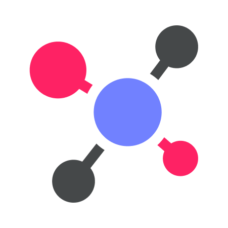

<p align="center">
    
</p>
<p align="center"> <h1>Soda</h1></p>


A GraphQL Schema Tooling to make schema composing in Scala more convenient, built on Sangria.

## Setup

**Latest Published Version**: `0.4.4`

```sbt
"io.github.d-exclaimation" % "soda" % latestVersion
```

## Usage/Examples

- [Documentation](https://soda-tools.netlify.app)
- [Quick start](https://soda-tools.netlify.app/docs/getting-started/setup)
- [Schema tooling](https://soda-tools.netlify.app/docs/guides/schema)

## Interoperability with Sangria

Soda is built on Sangria, you can use Soda with existing Sangria schema. Even if you don't want to use the Schema tooling, you can still take advantage some features of Soda 

Read more:

- [Root Schema Field](https://soda-tools.netlify.app/docs/features/using-sangria-schema)
- [SDL Artifact](https://soda-tools.netlify.app/docs/features/sdl-artifacts)

## Quick Start

<details>
<summary><b>Example Schema</b></summary>

Target SDL

```graphql
type User {
    id: String!
    name: String!
}

type Query {
    user(id: String!): User
    users: [User!]!
}
```

#### User

```scala
import io.github.dexclaimation.soda.schema._
import sangria.schema.StringType

case class User(id: String, name: String)

object User extends SodaObjectType[Unit, User]("User") {
  def definition: Def = { t =>
    t.id(of = _.id)
    t.prop("name", StringType, of = _.name)
  }
}
```

#### Query type

```scala
import io.github.dexclaimation.soda.schema._
import sangria.schema.{IDType, OptionType, ListType}

class Repo {
  private val Users = Map("1" -> User("1", "Bob"))

  def user(id: String): Option[User] =
    Users get id

  def products: List[Product] = Users.values.toList
}

object UserQuery extends SodaQuery[Repo, Unit] {
  val id = $("id", IDType)

  def definition: Def = { t =>
    t.field("user", OptionType(User.t), args = id :: Nil) { c =>
      c.ctx.user(c.arg(id))
    }

    t.field("users", ListType(User.t)) { _.ctx.users }
  }
}
```

Get the final schema

```scala
import io.github.dexclaimation.soda.utils.SchemaDefinition.makeSchema

val schema = makeSchema(UserQuery.t)
```
</details>

## Feedback

If you have any feedback, please reach out to me through the issues tab or Twitter [@d_exclaimation](https://twitter.com/d_exclaimation)

## Acknowledgements

This package is inspired by [Nexus](https://github.com/graphql-nexus/nexus).

<i>Icons made by <a href="https://www.flaticon.com/" title="Flaticon">
flaticon</a></i>

